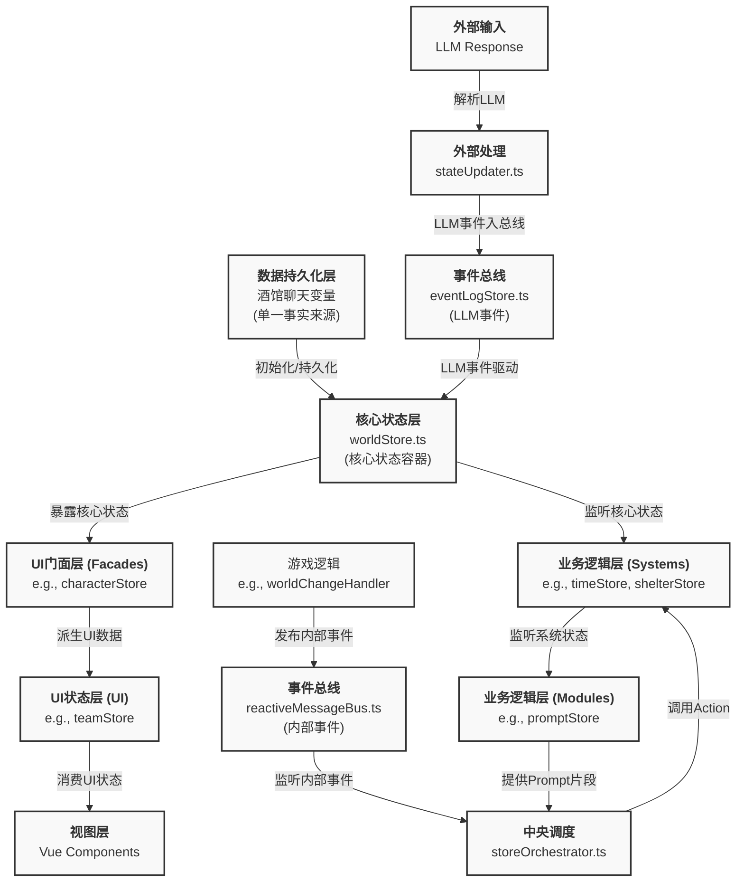

# 同层卡的编写——从架构到落地

本文档是《什么？我要在玄幻修仙世界种田？》0楼版本项目的核心开发指南，旨在阐述如何从零开始，遵循项目既定的最终架构，设计并实现一个完整的、可维护、可扩展的“同层卡”（即核心玩法模块）。

这份教程是项目的精髓所在，它将剥离所有具体的应用层实现，聚焦于支撑整个游戏世界的骨架——**一个以`worldStore`为中心、事件驱动、响应式衍生的状态管理架构**。

理解并遵循本教程的规范，是所有新功能开发和旧模块重构的基石。

## 第零章：为什么要写“同层卡”

在深入技术细节之前，我们有必要先回答一个根本问题：**我们为什么选择构建“同层卡”这种看似复杂的架构？**

“同层卡”，顾名思义，就是所有游戏交互都在同一个聊天楼层（第0层）内完成，而不依赖于不断增加新的聊天记录来推进游戏。

这是一种“无可奈何”下的最优选择，其根源在于我们所依赖的底层平台——SillyTavern的技术局限性：

1. **陈旧的技术栈**: SillyTavern作为一个历史悠久的项目，其前端核心仍然依赖于像JQuery这样已经落后于时代的框架。这使得开发复杂的、响应式的用户界面变得异常困难和低效。

2. **前端的性能瓶颈**: 项目本身是一个单页应用（SPA），并且大量使用 `innerHTML` 进行动态内容渲染。这种架构将过多的渲染和计算任务交给了前端。当聊天楼层堆积到上百层时，DOM结构变得异常庞大，导致页面交互出现肉眼可见的卡顿，严重影响长程游戏体验。

**“同层卡”正是为了从根本上规避这些问题而设计的。**

我们的核心思路是：**将“状态持久化”的任务从“聊天楼层”彻底剥离，转交给酒馆强大的“变量系统”**。

* **聊天楼层只负责展示**: 它不再是游戏状态的载体，仅仅是当前交互内容的“显示器”。
* **变量系统成为唯一事实来源**: 所有的游戏世界状态、角色属性、任务进度等，都以结构化数据的形式存储在酒馆变量中。

通过这种方式，我们绕开了SillyTavern的性能瓶颈，换来了一个高性能、高可塑性的应用层。我们得以在这一层之上，自由地运用Vue、Pinia等现代前端技术，构建出复杂、流畅、媲美原生应用的游戏体验。

理解了这一历史背景，你将能更好地体会后续章节中每一个架构决策的深意。

---
## 0.2 两种“同层卡”实现思路的对比

社区中对于“同层卡”的实现，大致存在两种主流思路。理解它们的区别，能帮助我们更深刻地认识到当前架构的优势所在。

### 思路一：前端UI接管 + 利用酒馆消息层

这种思路的核心是**在前端构建一个独立的UI层，同时巧妙地利用酒馆原生的消息记录功能来做“免费”的持久化**。

*   **简单方案**:
    *   **做法**: 在前端界面内通过酒馆助手的 `generate()` API触发AI回复，监听流式事件来更新自己的UI。为了记录剧情，将前端的正文深度调成最大（`0`），然后用 `setChatMessages` 等函数在后台修改酒馆的消息楼层，但不刷新显示。
    *   **优点**: 实现相对简单，能够快速做出一个独立的UI界面，并且免费利用了酒馆的消息记录和回溯功能。
    *   **缺点**:
        *   **状态与表现强耦合**: 游戏的状态（剧情）和它的表现（聊天记录）被绑定在了一起。这意味着任何对状态的操作都必须通过操作聊天记录来完成，非常不灵活。
        *   **非结构化数据**: 聊天记录是纯文本，是非结构化的。想要从中精确地恢复游戏状态（比如玩家有多少钱，物品栏里有什么）会非常困难，需要大量的正则表达式和文本解析，极易出错。
        *   **性能问题未根除**: 虽然UI是自己的，但它依然在后台悄悄地堆砌聊天楼层。当楼层增多，SillyTavern的性能问题依然会浮现。

*   **更自由的办法**:
    *   **做法**: 完全隐藏酒馆的消息楼层，自己从头做一个楼层显示。通过监听 `tavern_events` 来获取完整的流式文本，自己控制UI渲染。
    *   **优点**: 对UI的控制力达到了极致，可以实现任何想要的视觉效果。
    *   **缺点**:
        *   **重复造轮子**: 本质上是重新实现了一遍SillyTavern的消息管理和渲染机制，工作量巨大。
        *   **核心问题未解决**: 状态管理依然依赖于解析非结构化的聊天文本，这使得构建复杂、可靠的游戏系统（如商店、背包、技能）变得几乎不可能。

### 思路二：变量系统为核心 + 前端纯渲染 (本项目架构)

我们的架构选择了另一条更彻底的道路：**将状态管理与UI渲染完全分离，以酒馆的变量系统作为唯一的核心**。

*   **做法**:
    1.  **状态先行**: 所有游戏状态（世界、角色、物品等）都被设计成**结构化数据**，存储在酒馆变量中。
    2.  **事件驱动**: AI的回复被解析为一系列**结构化的事件**（如 `{"事件": "物品变化", "物品": "苹果", "数量": -1}`），而不是一段纯文本。
    3.  **前端是“结果”的忠实呈现**: 前端UI（Vue组件）的唯一职责，就是**响应式地**渲染变量系统中的当前状态。它不参与任何游戏逻辑的计算。

*   **优点**:
    *   **彻底解耦**: 状态（数据）与表现（UI）完全分离。我们可以随时更换UI框架，甚至将核心逻辑移植到其他平台，而无需改动状态管理的核心。
    *   **结构化与可靠性**: 所有状态都是结构化的，读写操作精确、可靠，从根本上避免了文本解析带来的不确定性。这为构建复杂的游戏系统（如需要精确计算的经济系统、背包系统）奠定了坚实的基础。
    *   **高性能**: 我们完全绕开了SillyTavern的消息楼层机制，从根本上解决了长上下文导致的性能瓶颈。
    *   **可测试性与可维护性**: 业务逻辑（Pinia Stores）与UI分离，使得对核心逻辑进行单元测试和集成测试成为可能，极大地提高了代码质量和长期可维护性。

*   **缺点**:
    *   **前期投入更高**: 需要预先设计好所有的数据结构和事件类型，并构建一套完整的响应式状态管理框架。

### 结论

社区中较为流行的方案是一种聪明的“渐进式改良”，它在不完全脱离SillyTavern原有体系的情况下，提升了UI的自由度。
而我们的方案则是一种“革命性重构”。我们选择承受更高的前期架构成本，以换取一个**高性能、高可靠、高可维护性**的坚实平台，从而能够支撑起一个真正复杂、长期的游戏体验。这便是我们做出如此选择的根本原因。

---

## 第一章：核心架构哲学

在动手编写任何代码之前，必须先理解我们的“宇宙法则”。这个法则由 `FINAL_ARCHITECTURE.md` 定义，其核心思想可以总结为以下几点：

### 1.1 最终架构图

这是我们所有开发的“导航地图”和“共同语言”。



### 1.2 核心共识解读

1. **`worldStore` 是宇宙的中心**:
    * 一切的根基是 **`A[酒馆聊天变量]`**，它是持久化状态的唯一权威。
    * **`B[worldStore]`** 是这个权威数据在内存中的**响应式镜像**和**守护者**。它是所有核心游戏状态的唯一管理者。任何对 `世界` 或 `角色` 变量的修改，最终都必须通过 `worldStore` 来完成。

2. **事件驱动，而非命令驱动**:
    * **LLM事件流**: 来自LLM的、需要持久化和可重放的状态变更，走 `eventLogStore` -> `worldStore` 路径。这是驱动游戏世界演变的主动脉。
    * **内部事件流**: 内部的、瞬时的、用于模块解耦的通知，走 `reactiveMessageBus` -> `storeOrchestrator` -> `目标Store` 路径。

3. **拥抱响应式衍生**:
    * 这是架构的精髓。所有业务逻辑Store（`Systems`层）都像“卫星”一样环绕着 `worldStore`。
    * 它们优先使用 `watch` 和 `computed` **响应式地**从 `worldStore` 或其他上游 Store 获取状态，并执行自己的业务逻辑，而不是通过手动的命令式调用。

4. **清晰的UI分层**:
    * UI组件和UI Store (`UI` / `Facade` 层)只负责“读”和“展示”，将所有“写”和业务逻辑都封装在 `Systems` 和 `Core` 层的 Store 中。

### 1.3 更广泛的设计理念

除了上述核心架构，整个项目还遵循着一些重要的上层设计理念，它们共同保证了项目的可维护性和可扩展性：

1. **调试先行 (Debugging First)**
    一个良好的调试系统是所有中大型项目的生命线。我们强调，调试功能并非事后添加的补丁，而是与业务功能同等重要的核心组成部分。这包括：
    * **核心状态观测**: 提供一个界面，可以实时查看 `worldStore` 等核心数据，理解当前游戏世界的精确状态。
    * **事件注入**: 允许开发者手动触发任何游戏事件，用以快速测试 `System Store` 中的事件处理器是否按预期工作，而无需通过繁琐的游戏流程来触发。

2. **事件驱动，而非持久性驱动 (Event-Driven over Persistence-Driven)**
    我们明确地选择**事件溯源**作为状态管理的唯一模式。我们不依赖LLM通过上下文“记住”游戏状态。原因在于：
    * **LLM的“惯性”不可靠**: 在短对话中，LLM或许能维持状态稳定，但在长程游戏中，这极易出错，导致状态不一致。
    * **前端是状态的唯一权威**: 游戏的核心状态由前端（通过 `worldStore`）全权管理。LLM的角色是响应用户输入并**生成事件**，而不是维护状态。这种模式保证了状态的绝对可控和可追溯。

3. **响应式 + 事件总线 (Reactivity + Event Bus)**
    我们完全拥抱现代前端框架（Vue + Pinia）带来的开发范式，彻底抛弃了以JQuery为代表的命令式DOM操作。
    * **响应式驱动**: 数据是驱动UI更新的唯一来源。我们不手动修改界面，只修改数据，界面会自动随之更新。
    * **事件总线解耦**: 对于非父子组件或Store之间的通信，我们使用 `reactiveMessageBus` 作为总线。这允许模块之间进行“广播式”通信，一个模块发布事件，多个其他模块可以监听并响应，实现了高度解耦。

4. **包装底层 (Wrapping the Lower Level)**
    为了实现长期的可维护性和平台迁移的便利性，我们致力于将与底层平台（如SillyTavern、酒馆助手）强相关的API进行封装。这意味着，我们不会在业务代码中直接调用 `getCharVar()` 或 `setVar()` 等函数，而是通过一个专门的适配层。
    * **易于迁移**: 当未来出现更好的LLM交互平台时，我们只需重写这个适配层，而无需改动任何核心业务逻辑代码，即可实现项目的无缝迁移。

5. **测试驱动 (Testing Driven)**
    我们坚信，代码的可测试性是衡量其质量的黄金标准。因此，测试并非开发流程结束后的“补充作业”，而是与功能设计和编码同等重要的、贯穿始终的核心环节。项目的测试策略是双管齐下的：

    *   **单元测试 (Unit Testing)**: 我们为每一个独立的 `Store` 编写了详尽的单元测试（如 `UNIT_TEST_COMPLETION_PLAN.md` 和 `UNIT_TEST_COMPLETION_PLAN_V2.md` 所示）。这确保了最小的业务逻辑单元（计算属性、事件处理器、Action等）在各种边缘情况下都能正确、健壮地工作。
    *   **集成测试 (Integration Testing)**: 我们设计了覆盖核心业务流程的集成测试（见 `INTEGRATION_TEST_PLAN.md`）。它验证从“模拟的LLM响应”输入，到核心事件流处理，再到多个 `Store` 状态被正确更新的整个端到端数据流的准确性。

    这种全面的测试覆盖之所以成为可能，完全得益于我们的核心架构。然而，要真正做到“测试先行”，在编写业务逻辑时，就必须提前思考如何让代码变得易于测试。最重要的两点是：

    *   **区分生产与测试状态**: 我们的测试环境通过 `vitest` 等工具与生产环境隔离。在测试中，我们可以完全控制外部依赖，例如模拟 `window` 对象或API调用。
    *   **优雅地引入Mock Store**: 这是可测试性的关键。我们不直接在业务代码中硬编码对某个 `Store` 的依赖，而是通过**依赖注入 (Dependency Injection)** 的方式，在测试运行时动态地替换掉真实的 `Store`。我们的集成测试设置 (`integrationTestSetup.ts`) 完美地诠释了这一过程：

        **第一步：在测试文件中准备 Mock 实例**
        在每个测试用例开始前 (`beforeEach`)，我们从 `__mocks__/stores` 中获取一个干净、隔离的 `worldStore` 实例。这个实例是专为本次测试服务的，它的任何状态变化都不会影响到其他测试。

        ```typescript
        // in a test file, e.g., none.integration.test.ts
        import { useWorldStore } from '../__mocks__/stores'; // 1. 导入 Mock Store
        import { setupIntegrationTest } from './integrationTestSetup';

        let worldStore: ReturnType<typeof useWorldStore>;

        beforeEach(() => {
          // 2. 获取一个干净的、可被断言的 store 实例
          worldStore = useWorldStore();
          
          // 3. 将 mock 实例作为参数，传递给测试设置函数
          const { handlers } = setupIntegrationTest({ worldStore });
          
          // ... 之后的所有操作都将作用于这个被注入的 mock 实例上
        });
        ```

        **第二步：在测试设置中完成“注入”**
        核心魔法发生在 `setupIntegrationTest` 函数内部。它接收测试文件传来的 `worldStore` 实例，并将其**注入**到负责处理LLM响应的核心生命周期函数 (`createGenerationLifecycleHandlers`) 中。

        ```typescript
        // in src/测试/integration/integrationTestSetup.ts
        export function setupIntegrationTest(options: { worldStore?: any }) {
          // ... 其他设置 ...

          // 如果测试文件提供了 worldStore 实例，就使用它；否则使用默认的 mock
          const mockWorldStore = options.worldStore || useMockWorldStore();

          // 关键一步：创建核心处理器，并将 mock store 作为依赖传入
          const handlers = createGenerationLifecycleHandlers({
            // ... 其他依赖 ...
            worldStore: mockWorldStore, // 注入！
          });

          return { handlers, ... };
        }
        ```
        通过这种方式，当测试代码调用 `handlers.onGenerationEnded()` 时，所有内部对 `worldStore` 的读写操作，实际上都作用于我们在测试文件中创建和控制的那个 `mockWorldStore` 实例上。

        这就建立了一个完美的闭环：测试代码**控制**输入（LLM响应）和初始状态（`worldStore`），**执行**核心逻辑（`handlers`），然后**断言**最终状态（还是那个 `worldStore`）。这种“可控性”和“可预测性”正是编写高质量、可维护代码的基石。

---

## 第二章：“同层卡”的生命周期

一个“同层卡”（核心玩法模块）的开发，本质上是遵循上述架构，完成一个从“数据定义”到“UI展现”再到“反馈给AI”的完整闭环。

这个生命周期可以被清晰地划分为以下六个步骤：

1. **Step 1: 定义数据源头 (State)** - 在酒馆变量中定义你的数据结构。
2. **Step 2: 创建业务逻辑核心 (System Store)** - 创建一个Pinia Store来管理模块的业务逻辑。
3. **Step 3: 响应LLM事件 (Event Handling)** - 让你的Store能够理解并处理来自LLM的事件。
4. **Step 4: 打造UI门面 (Facade Store)** - （可选）创建一个中间层来派生UI友好的数据。
5. **Step 5: 编写视图组件 (View Component)** - 创建Vue组件来消费数据并与用户交互。
6. **Step 6: 闭环：反馈给LLM (Prompt Injection)** - 将模块的状态变化实时反馈给LLM，影响后续决策。

---

## 第三章：实战演练：从零到一实现“任务系统”

接下来，我们将以开发一个简化的“任务系统”为例，完整地走完上述六个步骤。

### Step 1: 定义数据源头 (State)

一切始于数据。我们需要在酒馆变量（对应 `world.value`）中为“任务”留出位置。

**位置**: `世界` 变量
**结构**:

```json
{
  "任务": {
    "已接取": {
      "Q001": { "名称": "初识炼丹", "进度": 1, "总进度": 3, "描述": "收集3株凝血草。" },
      "Q002": { "名称": "拜访铁匠", "进度": 0, "总进度": 1, "描述": "与青石镇的王铁匠对话。" }
    },
    "已完成": ["Q000"],
    "可接取": ["Q003"]
  }
}
```

这是我们的“单一事实来源”。一旦定义完成，`worldStore` 将自动成为它在内存中的守护者。

### Step 2: 创建业务逻辑核心 (`questStore.ts`)

现在，我们创建一个 `System` 层的Pinia Store来封装所有与任务相关的业务逻辑。

**路径**: `src/stores/systems/questStore.ts`

```typescript
import { defineStore } from 'pinia';
import { useWorldStore } from '../core/worldStore';
import { computed } from 'vue';

export const useQuestStore = defineStore('quest', () => {
  const worldStore = useWorldStore();

  // **响应式衍生**: 直接从 worldStore 获取原始数据
  const quests = computed(() => worldStore.world.任务);

  // **业务逻辑**: 派生出更易于使用的数据
  const activeQuests = computed(() => {
    if (!quests.value?.已接取) return [];
    return Object.entries(quests.value.已接取).map(([id, data]) => ({ id, ...data }));
  });

  const isQuestCompleted = (questId: string) => {
    return quests.value?.已完成?.includes(questId) ?? false;
  };

  // 更多业务逻辑...
  // function completeQuest(questId: string) { ... } // 注意：这里的修改逻辑应由LLM事件驱动

  return {
    quests,
    activeQuests,
    isQuestCompleted,
  };
});
```

**核心要点**: `questStore` **不直接修改** `worldStore` 的状态。它只是 `worldStore` 的一个“观察者”和“解释者”。

### Step 3: 响应LLM事件 (Event Handling)

当玩家在游戏中完成某个动作（例如，收集了草药），LLM会返回一个事件来更新任务状态。我们的架构需要能处理这个事件。

**LLM可能返回的事件**:

```json
{ "事件": "任务更新", "ID": "Q001", "进度": 2 }
```

或

```json
{ "事件": "任务完成", "ID": "Q001" }
```

**处理流程**:

1. `stateUpdater.ts` 解析LLM回复，识别出这些事件。
2. `eventLogStore.ts` 记录这些事件。
3. `worldStore.ts` 监听到 `eventLogStore` 的变化，开始处理事件。

为了让 `worldStore` 知道如何处理 `任务更新` 事件，我们需要在 `questStore` 中定义处理器，并通过 `worldStore` 的注册表模式进行注册。

**在 `questStore.ts` 中**:

```typescript
// ...
import { onMounted } from 'vue';

export const useQuestStore = defineStore('quest', () => {
  const worldStore = useWorldStore();
  // ... (其他代码)

  // 定义事件处理器
  const handleQuestUpdate = (eventData: any) => {
    const { ID, 进度 } = eventData;
    if (worldStore.world.任务?.已接取?.[ID]) {
      worldStore.world.任务.已接取[ID].进度 = 进度;
    }
  };

  const handleQuestComplete = (eventData: any) => {
    const { ID } = eventData;
    if (worldStore.world.任务?.已接取?.[ID]) {
      delete worldStore.world.任务.已接取[ID];
      if (!worldStore.world.任务.已完成) {
        worldStore.world.任务.已完成 = [];
      }
      worldStore.world.任务.已完成.push(ID);
    }
  };

  // **注册**: 在 store 初始化时，将处理器注册到 worldStore
  onMounted(() => {
    worldStore.registerEventHandler('任务更新', handleQuestUpdate);
    worldStore.registerEventHandler('任务完成', handleQuestComplete);
  });

  // ...
});
```

通过这种方式，`worldStore` 保持了其作为“事件循环器”的纯粹性，而具体的业务逻辑则被完美地封装在了各自的 `System` Store 中。

### Step 4: 打造UI门面 (Facade Store)

对于任务系统，`questStore` 派生的 `activeQuests` 已经足够UI使用，我们可以暂时跳过这一步。

但对于更复杂的系统（如角色、物品），我们通常会创建一个 `Facade` Store（如 `characterStore`, `itemStore`），它会从多个 `System` Store 和 `worldStore` 中组合数据，为UI提供一个极其干净、即取即用的数据模型。

### Step 5: 编写视图组件 (`QuestTab.vue`)

现在，UI层可以极其简单地消费 `questStore` 准备好的数据。

**路径**: `src/components/system/QuestTab.vue`

```vue
<template>
  <div class="quest-tab">
    <h3>进行中的任务</h3>
    <ul>
      <li v-for="quest in questStore.activeQuests" :key="quest.id">
        <strong>{{ quest.名称 }}</strong> ({{ quest.进度 }}/{{ quest.总进度 }})
        <p>{{ quest.描述 }}</p>
      </li>
    </ul>
  </div>
</template>

<script setup>
import { useQuestStore } from '@/stores/systems/questStore';

const questStore = useQuestStore();
</script>
```

**核心要点**:

* 视图组件 **极其纯净**。它只负责从 `questStore` 中读取数据并展示。
* 它不包含任何业务逻辑。所有计算和数据派生都已在上游的 Store 中完成。

### Step 6: 闭环：反馈给LLM (`promptStore.ts`)

最后一步，也是至关重要的一步，是让LLM“知道”当前的任务状态，以便它能生成更相关的剧情。这通过 `promptStore` 实现。

`promptStore` 会响应式地监听所有相关的 `System` Store，并动态构建系统提示词。

**在 `promptStore.ts` 中**:

```typescript
import { defineStore } from 'pinia';
import { useQuestStore } from '../systems/questStore';
import { computed, watch } from 'vue';

export const usePromptStore = defineStore('prompt', () => {
  const questStore = useQuestStore();
  
  // ... 其他 store

  // 响应式地生成任务部分的 prompt
  const questPromptPart = computed(() => {
    if (questStore.activeQuests.length === 0) {
      return '当前没有进行中的任务。';
    }
    const questLines = questStore.activeQuests.map(q => 
      `- ${q.名称}: ${q.描述} (进度: ${q.进度}/${q.总进度})`
    );
    return `玩家当前的任务是：\n${questLines.join('\n')}`;
  });

  // 最终的系统提示词会组合所有部分
  const systemPrompt = computed(() => {
    // ... (组合角色信息、地点信息等)
    return `... ${questPromptPart.value} ...`;
  });

  // ...
  return { systemPrompt };
});
```

现在，每当 `questStore.activeQuests` 发生变化时，`promptStore.systemPrompt` 都会自动更新，确保LLM在下一次交互时，总能拿到最新的任务信息。

---

## 第四章：高级议题：状态重算与架构权衡

在我们的生命周期中，有一个隐藏但至关重要的环节：**状态重算 (State Recalculation)**。当用户切换历史记录（`Swipe`）或加载游戏时，我们需要一种机制来确保游戏世界恢复到那个时间点的精确状态。

这引出了一个核心的架构决策：**存储优先 vs. 开发优先**。

### 4.1 两种模式的对比

1. **开发优先 (Development-First / 状态持久化)**
    * **做法**: 在每次收到LLM的事件后，立即计算出完整的最终状态，并将这个庞大的、计算好的状态对象直接持久化（写入酒馆变量）。
    * **优点**:
        * **开发简单**: 状态恢复极其容易，只需读取并加载那个时间点的快照即可。
        * **逻辑直观**: “所见即所得”，持久化的数据就是游戏当时的状态。
    * **缺点**:
        * **存储冗余**: 每个历史记录点都存一份完整的世界状态，会导致数据量爆炸式增长。
        * **性能瓶颈**: 频繁地序列化和写入巨大的JSON对象会非常缓慢。
        * **难以溯源**: 当出现状态错误时，你只知道结果错了，但很难追查是哪个事件导致了错误。

2. **存储优先 (Storage-First / 事件溯源 - 本项目选择)**
    * **做法**: 我们**只持久化导致状态变化的“事件”本身**（记录在 `eventLogStore` 和 `聊天历史` 中），而不是状态的结果。最终的游戏状态 (`world.value`) 是通过从创世之初（或某个检查点）开始，**重放 (Replay)** 所有历史事件计算出来的，并存放在内存中。
    * **优点**:
        * **存储高效**: 只存储小体积的事件对象，极大地减少了持久化数据的体积。
        * **高性能**: 写入操作非常快，因为事件对象很小。
        * **完全可追溯**: 整个游戏世界是透明的、可审计的。任何状态问题都可以通过检查事件日志来精确复现和调试。
        * **时间旅行能力**: 切换历史记录（`Swipe`）变得轻而易举，只需重算到目标消息对应的事件点即可。

    * **缺点**:
        * **开发复杂**: 需要构建一套健壮的事件处理和状态重算机制。
        * **心智负担**: 开发者需要从“直接修改状态”转变为“通过事件间接改变状态”的思维模式。

### 4.2 为什么我们选择“存储优先”

对于一个需要支持长程游戏、复杂交互和历史回溯的LLM应用来说，“存储优先”的事件溯源模式是必然选择。它通过前期的架构复杂性投入，换取了后期的**高性能、高可维护性和强大的调试能力**。

### 4.3 性能优化：三级缓存策略

单纯的事件溯源在历史记录很长时，从头重放所有事件会导致性能问题。为了解决这个问题，我们引入了一套**三级缓存策略**，在不同场景下高效、准确地获取状态重算的“起点”，实现了性能与准确性的最佳平衡。

* **L1 缓存 (热缓存): 上一回合的最终状态**
  * **定义**: 指第N-1回合的最终状态。这是一个高频访问的、临时的内存状态，不被持久化。
  * **用途**: 专门用于在当前回合（第N回合）内**生成**新的可能性（Swipes）。这是最高效的回溯路径。

* **L2 缓存 (温缓存): 分支状态快照**
  * **定义**: 周期性（例如每20回合）保存的、持久化在 `世界.{分支ID}.状态快照` 中的完整游戏状态。
  * **用途**: 用于**查看**或**回溯**到较远的历史消息页，或**创建新分支**时，作为事件重放的起点，是长距离跳转的性能保障。

* **L3 缓存 (冷缓存): 游戏初始状态**
  * **定义**: 游戏开局时生成的、持久化在 `世界.初始状态` 中的“创世快照”，并拥有冗余备份。
  * **用途**: 作为所有状态计算的最终基石。当没有任何L2快照可用时，系统会从L3开始重放事件，确保绝对的状态准确性和存档韧性。

通过这套智能缓存调度机制，分级的响应式Store设计（`Core -> System -> Facade -> UI`）能够最大化发挥其性能优势：系统总能从最近的快照开始进行最小化的事件重放，快速重建 `worldStore` 的基础状态，而上层Store则通过 `computed` 缓存计算结果，避免了不必要的重复计算，保证了即使在事件繁多的情况下，UI也能流畅响应。

### 4.4 代码实现：缓存调度伪代码

为了更具体地理解缓存策略，以下是核心调度逻辑的伪代码实现：

**场景一：请求生成同一回合的新消息页 (使用 L1 缓存)**

```typescript
// 责任模块: core/actions.ts
async function generateAnotherSwipe() {
  // 1. 直接从内存中获取上一回合的最终状态（L1 缓存）
  const lastTurnState = stateManager.getL1Cache();

  // 2. 基于 L1 缓存的状态构建 Prompt
  const prompt = promptManager.buildPromptForNewSwipe(lastTurnState);

  // 3. 请求 LLM 生成新消息
  const newResponseMessage = await llm.generate(prompt);

  // 4. 应用新事件到 L1 缓存状态上，形成新的独立状态
  const newSwipeState = eventHandler.applyEvents(lastTurnState, newResponseMessage.events);
  
  // 5. 保存新消息，并将新状态写入变量
  historyManager.addSwipe(newResponseMessage);
  variableManager.saveState(newSwipeState);
}
```

**场景二：切换并查看已存在的消息页 (智能缓存调度)**

```typescript
// 责任模块: index.ts -> recalculateAndApplyState
async function recalculateAndApplyState(targetMessageId: string) {
  const targetMessageInfo = historyManager.getMessageInfo(targetMessageId);

  // 1. 智能寻找事件重放的起点
  // 尝试从 L2 缓存（状态快照）中找到离目标最近的快照
  let { startState, eventsToReplay } = findLatestSnapshot(targetMessageInfo.branchId, targetMessageInfo.turnIndex);

  // 2. 如果没有找到 L2 快照，则回退到 L3 缓存（初始状态）
  if (!startState) {
    startState = variableManager.getInitialState(); // L3 Cache
    eventsToReplay = historyManager.getAllEventsSinceBeginning(targetMessageId);
  }

  // 3. 从找到的起点开始，重放事件，计算出目标状态
  const targetState = eventHandler.replayEvents(startState, eventsToReplay);

  // 4. 将计算出的精确状态，原子化地覆盖到当前酒馆变量中
  variableManager.overwriteAllChatVariables(targetState);

  // 5. 发出信号，通知所有 UI store 从新变量中拉取数据并刷新
  messageBus.emit('variablesSynced');
}
```

---

## 结论

通过遵循“数据定义 -> 逻辑派生 -> 事件处理 -> UI展示 -> 反馈AI”这一完整闭环，我们构建了一个健壮、解耦且高度可维护的模块。

这便是“同层卡”的编写之道，也是整个项目能够不断生长、演化的核心动力。请将这一模式内化于心，并应用到未来的每一次开发中。

---

## 附录：开发者速查表与最佳实践

本附录旨在为开发者提供一个快速参考，总结项目中最核心的API、最常见的代码模式以及最重要的开发原则。

### A1. 核心Store速查

| Store | 核心职责 | 常用API / 属性 |
| :--- | :--- | :--- |
| `useWorldStore` | 宇宙中心。管理所有持久化的核心游戏状态 (`世界`、`角色`)。 | `.world`, `.character`, `registerEventHandler()` |
| `useEventLogStore` | LLM事件总线。记录所有来自LLM的、需要持久化的事件。 | `.log`, `.addEvent()` |
| `reactiveMessageBus` | 内部事件总线。用于Store和模块间的瞬时、解耦通信。 | `.on()`, `.emit()` |
| `usePromptStore` | 动态提示词生成器。响应式地从其他Store收集信息，构建最终的系统提示词。 | `.systemPrompt` |
| `storeOrchestrator` | 中央调度器。监听内部事件，并调用相应`System` Store的Actions。 | (通常在后台运行，无需直接调用) |

### A2. 常见模式与代码片段 (Cookbook)

**1. 如何正确地从`worldStore`衍生计算属性？**

```typescript
// in stores/systems/someStore.ts
import { computed } from 'vue';
import { useWorldStore } from '../core/worldStore';

const worldStore = useWorldStore();
// ✅ 正确: 使用 computed 包装，实现高效缓存
const playerLevel = computed(() => worldStore.character.level);
const isShelterBuilt = computed(() => worldStore.world.庇护所?.等级 > 0);
```

**2. 如何监听另一个Store的变化？**

```typescript
// in stores/systems/achievementStore.ts
import { watch } from 'vue';
import { useQuestStore } from './questStore';

const questStore = useQuestStore();
// ✅ 正确: 使用 watch 监听其他 store 的状态变化
watch(() => questStore.completedQuests, (newCompletedQuests) => {
  if (newCompletedQuests.includes('Q100')) {
    unlockAchievement('主线完结');
  }
});
```

**3. 如何发布和监听一个内部事件？**

```typescript
// 发布方: e.g., in timeStore.ts after a day passes
import { reactiveMessageBus } from '@/core/reactiveMessageBus';
reactiveMessageBus.emit('newDayStarted', { date: newDate });

// 监听方: e.g., in storeOrchestrator.ts
import { reactiveMessageBus } from '@/core/reactiveMessageBus';
reactiveMessageBus.on('newDayStarted', (payload) => {
  const signInStore = useSignInStore();
  signInStore.checkForDailySignIn(payload.date);
});
```

**4. 如何为一个新模块注册LLM事件处理器？**

```typescript
// in stores/systems/weatherStore.ts
import { onMounted } from 'vue';
import { useWorldStore } from '../core/worldStore';

export const useWeatherStore = defineStore('weather', () => {
  const worldStore = useWorldStore();

  const handleWeatherChangeEvent = (eventData) => {
    worldStore.world.天气 = eventData.新天气;
  };

  // ✅ 正确: 在 onMounted 中向 worldStore 注册自己的处理器
  onMounted(() => {
    worldStore.registerEventHandler('天气变化', handleWeatherChangeEvent);
  });
  
  return { ... };
});
```

### A3. “Do's and Don'ts”清单

* **Do**: **优先使用 `computed` 派生状态**。这是响应式系统的核心，能带来巨大的性能优势。
* **Don't**: **在UI组件 (`.vue`) 中直接修改 `worldStore` 的数据**。所有修改都应由 `worldStore` 内部的事件处理器完成。
* **Do**: **将所有由LLM驱动的、需要持久化的状态变更，都通过`eventLogStore` -> `worldStore` 的事件流来完成**。
* **Don't**: **在 `System` 层的Store之间进行命令式的互相调用** (e.g., `questStore.completeQuest()`)。优先使用事件总线或响应式监听 (`watch`) 来实现解耦。
* **Do**: **保持 `Facade` 和 `UI` 层的Store纯净**。它们只应该从上游读取和组合数据，不包含复杂的业务逻辑。
* **Don't**: **忘记在 `onMounted` 中注册事件处理器**。否则你的模块将对LLM的事件毫无反应。
