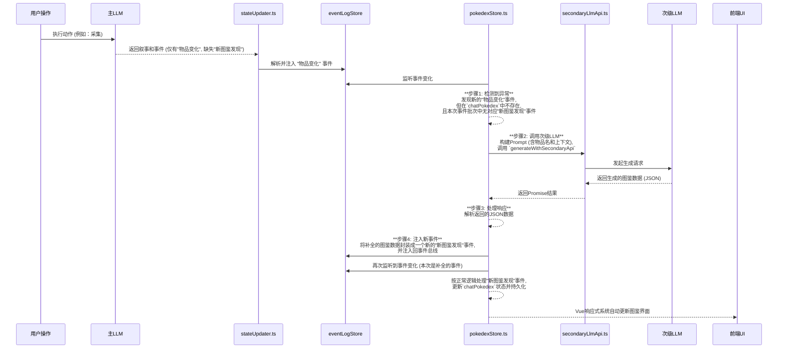

# 后台图鉴自动补全规范 (AUTO_POKEDEX_COMPLETION_SPEC.md) v1.0

本文档旨在为“后台图鉴自动补全”功能提供清晰、详细的设计规范。该功能的核心目标是解决主LLM在生成叙事时，偶尔遗漏`"新图鉴发现"`事件导致的数据不一致问题。通过利用次级LLM在后台静默地修复这些数据缺失，从而提升系统的健壮性和玩家的沉浸式体验。

## 1. 核心设计哲学

*   **无缝修复 (Seamless Restoration)**: 整个数据补全过程对用户应是透明的。系统在后台自动检测并修复数据，无需玩家干预。
*   **事件驱动 (Event-Driven)**: 严格遵循项目现有的事件驱动架构。功能的触发、执行和数据注入都通过标准的事件总线（`eventLogStore`）进行，确保逻辑的解耦与可追溯性。
*   **职责单一 (Single Responsibility)**: 数据补全的逻辑被严格限制在`pokedexStore`内。其他模块（如`stateUpdater`）的职责保持不变，仅作为事件的生产者和传递者。
*   **健壮性优先 (Robustness First)**: 内置错误处理机制。当次级LLM调用失败时，系统应能优雅地处理异常，并通过UI向用户提供非阻塞式的可选反馈。

## 2. 技术实现与工作流程

该功能的核心逻辑完全内聚在 `stores/systems/pokedexStore.ts` 中，通过扩展其现有的事件监听器来实现。

### 工作流程时序图

### 详细步骤分解

#### 阶段1: 异常检测 (在 `pokedexStore` 的事件监听器中)

1.  **监听事件批次**: `pokedexStore` 的 `watch` 函数应监听 `eventLogStore.latestEvents`，以获取每次由LLM生成的一批新事件。
2.  **识别潜在新物品**: 遍历事件批次中的所有 `"物品变化"` 事件。对于每个事件中的 `"获得"` 列表，提取出所有获得的物品名称。
3.  **交叉验证**:
    *   对于每一个获得的物品，检查它是否存在于当前的 `pokedexStore.chatPokedex` 中。
    *   如果不存在，则进一步检查**当前事件批次**中，是否存在一个针对该物品的 `"新图鉴发现"` 事件。
4.  **触发修复**: 如果一个物品在 `chatPokedex` 中不存在，并且在当前事件批次中也没有对应的 `"新图鉴发现"` 事件，则判定为一次“数据缺失异常”，并触发后续的修复流程。

#### 阶段2: 调用次级LLM进行修复

1.  **构建Prompt**: 根据缺失图鉴的物品名称，动态构建一个用于请求图鉴数据的Prompt。该Prompt应指示LLM根据物品名称生成符合`"新图鉴发现"`事件`payload`格式的JSON对象。
    *   **示例Prompt**: `"你是一个游戏世界设定生成器。请为一个名为‘荧光苔藓’的物品生成图鉴条目。请严格按照以下JSON格式返回，不要包含任何额外的解释或Markdown标记：{ "类型": "植物", "数据": { "名称": "荧光苔藓", "品阶": "凡品下阶", "描述": "...", "价值": { "基础价值": 3, "价值标签": ["炼丹材料"] } } }"`
2.  **调用API**: 使用构建好的Prompt，调用 `core/secondaryLlmApi.ts` 中暴露的 `generateWithSecondaryApi` 函数。
3.  **异步处理**: 该调用是异步的，后续步骤将在 `Promise` resolve后执行。

#### 阶段3: 数据注入与闭环

1.  **解析响应**: 在 `.then()` 回调中，接收次级LLM返回的字符串，并使用 `try...catch` 块尝试将其解析为JSON对象。
2.  **封装事件**: 将解析后的JSON对象作为 `payload`，创建一个新的 `GameEvent`，其 `type` 为 `"新图鉴发现"`。
3.  **注入总线**: 调用 `eventLogStore.addEvents()`，将这个新创建的补全事件注入回事件总线。
4.  **自动处理**: 由于 `pokedexStore` 自身也在监听 `eventLogStore`，这个被注入的新事件会被它自己捕获，并按照正常的图鉴发现流程进行处理，从而完成状态的更新和持久化，形成逻辑闭环。

#### 阶段4: 错误处理与用户反馈

1.  **捕获异常**: 在调用 `generateWithSecondaryApi` 的 `Promise` 链上使用 `.catch()` 来捕获所有潜在的错误（如网络问题、API密钥无效、JSON解析失败等）。
2.  **用户提示**: 当捕获到错误时，使用 `toastr` 或类似的用户通知系统，显示一条非阻塞的、信息明确的错误提示。
    *   **示例提示**: `"后台图鉴补全失败：无法连接至次级LLM服务。请检查您的网络或API设置。"`
3.  **避免阻塞**: 错误处理不应中断任何核心游戏流程。

## 3. 模块职责总结

*   **`stores/systems/pokedexStore.ts`**: **后台修复功能的核心**。
    *   **职责**: 监听事件、检测数据缺失、构建并发送修复请求、处理响应、将修复后的数据重新注入事件循环。
    *   **依赖**: `eventLogStore`, `secondaryLlmApi.ts`。
*   **`core/secondaryLlmApi.ts`**: **提供标准的次级LLM调用接口**。其职责保持不变，仅被 `pokedexStore` 调用。
*   **`eventLogStore.ts`**: **事件总线**。其职责保持不变，作为数据注入和触发逻辑的中心枢纽。
